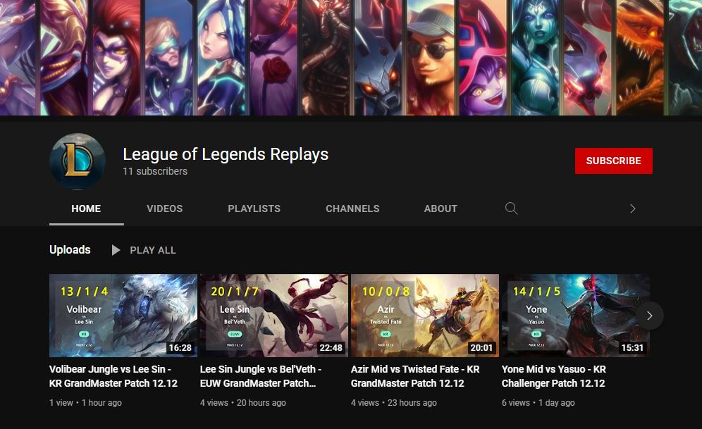
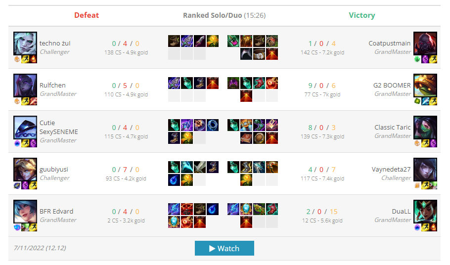
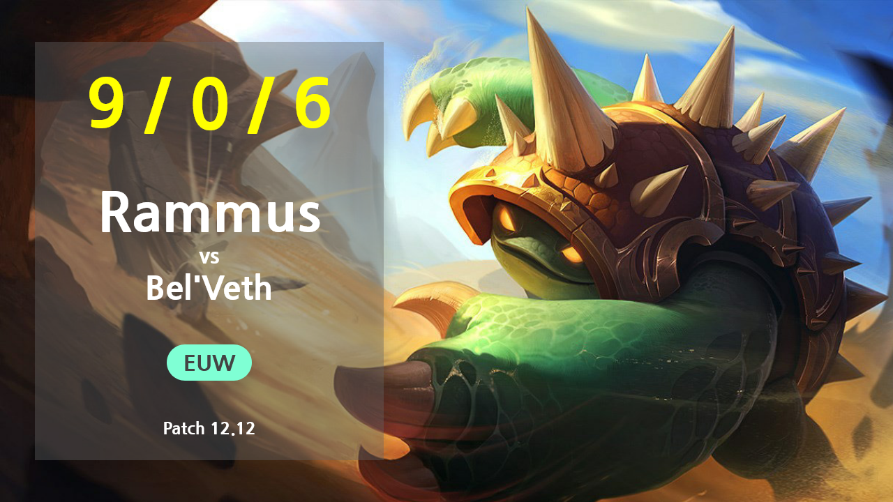

# Automatização de canal de Youtube

<a href="https://github.com/joaomaranhao/video-maker/blob/main/README.md">en-US</a>

#

A ideia desse projeto é automatizar a criação de vídeos, thumbnails e upload desse material para o Youtube.

É um canal de replays de partidas de um jogo chamado League of Legends.

Todo o processo é automatizado. Uma vez que o script é iniciado, ele consegue através de pequenos passos, criar conteúdo de forma programática.

O canal pode ser visualizado nesse link: [League of Legends Replays](https://www.youtube.com/channel/UC-C_dsVX2-G2UYA9IoD5i3Q)

#

#

## Pré-Requisitos

- [Python](https://www.python.org/downloads/) 3.9 ou superior ;
- [Poetry](https://python-poetry.org/docs/) ;
- [Firefox](https://www.mozilla.org/pt-BR/firefox/new/) 102 ou superior ;
- [OBS](https://obsproject.com/pt-br/download) (Open Broadcaster Software) ;
- Conta Google ;

## Tecnologias

- Web scraping com [Selenium](https://selenium-python.readthedocs.io/) ;
- HTML e CSS para a criação da thumbnail ;
- RPA (Robotic Process Automation) com [PyAutoGUI](https://pyautogui.readthedocs.io/en/latest/) ;
- [API do Youtube](https://developers.google.com/youtube/v3/quickstart/python) ;
- OAuth 2 ;

## Como funciona

O projeto foi criado com 5 módulos separados, cada um com sua responsabilidade.

Os módulos estão na pasta `videomaker/usecases`:

- scrap_lol_data (web scrapper)

  Entra no site, seleciona a partida, coleta todas as informações necessárias e baixa o replay (executável do jogo)

  

  #

- data

  Responsável por salvar e carregar as informações recebidas pelo web scrapper em um arquivo json

  #

- create_thumbnail

  Esse módulo cria uma thumbnail personalizada com HTML e CSS utilizando as informações obtidas pelo web scrapper

  

  #

- record_video

  Utiliza o PyAutoGUI e o PyDirectInput para controlar o jogo e o OBS para gravar a partida

  #

- upload_youtube

  Responsável por preencher informações como título, descrição e palavras-chave, fazer upload do vídeo e da thumbnail
